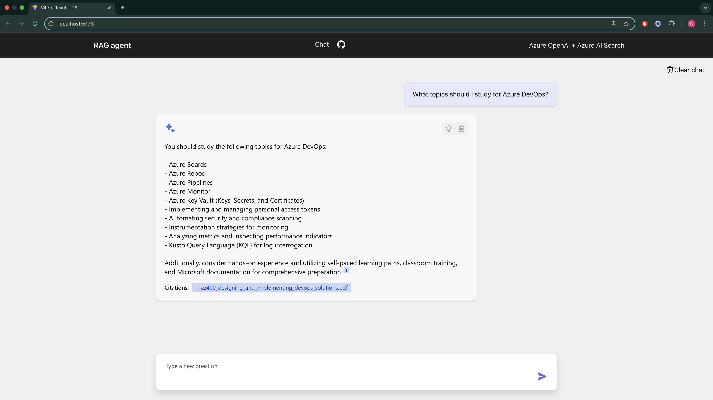
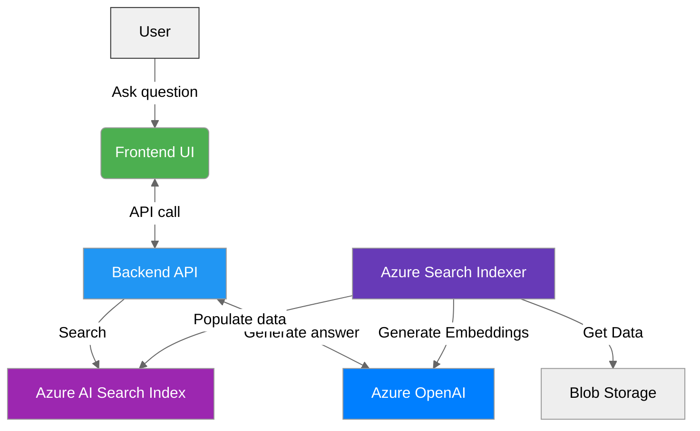

# Chat with Azure Docs - Certification Q&A Agent

[](https://azure.microsoft.com/en-us/products/ai-services/openai-service)
[](https://azure.microsoft.com/en-us/products/ai-services/ai-search)

An AI-powered RAG application leveraging Azure OpenAI and Azure AI Search to answer technical questions about Azure certifications. Automatically deployed infrastructure with full-stack implementation.

 <!-- Add actual screenshot path -->

## Features
- **AI-Powered Q&A**: GPT-4 answers with Azure certification exam context
- **Semantic Search**: Azure AI Search indexes technical documentation
- **Infra Deployment**: Terraform-provisioned Azure infrastructure
- **Secure API**: Managed identities for Azure service authentication

## Architecture


## 🚀 Quick Start

### Prerequisites
- Azure account with valid subscription
- Terraform v1.5+
- Java 17+, Maven
- Node.js 18+

### Setup Steps

1. Clone Repository
    ```bash
    git clone https://github.com/gmezan/azure-openai-search-rag.git
    cd azure-openai-search-rag
    ````

1. Deploy Azure Infrastructure

    ```bash
    cd infra/
    terraform init
    terraform apply
    ````


1. Configure & Start Backend

    ```bash
    # Set environment variables (use .env file or export)
    export AZURE_OPENAI_KEY="<from-terraform-output-or-portal>"
    export AZURE_OPENAI_ENDPOINT="<from-terraform-output-or-portal>"
    export AZURE_SEARCH_ENDPOINT="<from-terraform-output-or-portal>"
    export AZURE_SEARCH_KEY="<from-terraform-output-or-portal>"
    export AZURE_STORAGE_CS="<from-terraform-output-or-portal>"

    mvn spring-boot:run
    ````

1. Launch Frontend
    ```bash
    cd frontend/
    npm install
    npm run dev
    ````

1. Start Chatting

    Access frontend at http://localhost:5173 and ask questions like: "Explain Azure Virtual Network peering requirements for AZ-104"
   

https://github.com/user-attachments/assets/c9db6367-1e19-444e-b6e1-a3805ed72f2c


